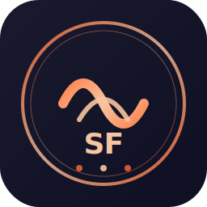

<div align="center">
  
  <h1>shadow_fiend</h1>
  <p><b>영화 시청용 로컬 실시간 자막 번역기</b></p>
  <p>
    <a href="README.md">English</a> •
    <a href="README.zh.md">中文</a>
  </p>
  <p>
    
    
    
    
  </p>
</div>

---

> **자막이 없는 영화도 볼 수 있게 만드세요.**
> shadow_fiend는 시스템 오디오를 캡처하고 SenseVoice로 로컬 음성 인식을 수행한 뒤 Argos로 번역하여 화면에 실시간 이중 자막을 표시합니다.

## 특징

- 🔒 **완전 오프라인** — 오디오가 외부로 전송되지 않음
- 🚀 **빠른 로컬 ASR** — 중일한에 최적화된 SenseVoice-Small
- 🌐 **로컬 번역** — Argos Translate 엔진, API 키 불필요
- 🎨 **플로팅 자막 오버레이** — 투명하고 항상 위에 표시되며 드래그 가능
- 🎬 **영화 시청용 설계** — 모든 플레이어의 시스템 오디오 캡처

## 빠른 시작

### 요구사항

- macOS 12+ (MVE 단계에서는 Apple Silicon)
- Python 3.10+
- Homebrew
- BlackHole 2ch 가상 오디오 드라이버

### 설치

```bash
git clone https://github.com/YansongW/shadow_fiend.git
cd shadow_fiend
./scripts/setup.sh
```

### macOS 오디오 라우팅

1. `Audio MIDI Setup`(`/Applications/Utilities/Audio MIDI Setup.app`) 열기
2. 좌측 하단 `+` 클릭 → **다중 출력 장치 생성**
3. 스피커/헤드폰과 **BlackHole 2ch** 모두 선택
4. 시스템 설정에서 기본 출력으로 설정

### 실행

```bash
./scripts/run.sh --source ko --target zh
```

지원 언어: `zh`, `en`, `ja`, `ko`.

## 개발 상태

MVE 단계입니다. 핵심 모듈이 구현되었고 단위 테스트를 통과했습니다:

- ✅ 오디오 캡처 (BlackHole + PyAudio)
- ✅ VAD 분할
- ✅ SenseVoice ASR
- ✅ Argos 번역
- ✅ PyQt6 자막 오버레이
- ✅ 엔드투엔드 pipeline

엔드투엔드 실시간 데모는 Python 3.10+ 및 Homebrew가 설치된 macOS 환경에서 검증해야 합니다.

## 테스트

```bash
./.venv/bin/python -m pytest tests/ -v
```

## 프로젝트 구조

```
shadow_fiend/
├── README.md
├── README.zh.md
├── README.ko.md
├── src/
│   ├── audio/       # 오디오 캡처 + VAD
│   ├── asr/         # SenseVoice 음성 인식
│   ├── translation/ # Argos 번역
│   ├── ui/          # 자막 오버레이
│   └── pipeline.py  # 흐름 조정
├── tests/
└── scripts/
```

## 상표 면책 조항

"Shadow Fiend"는 Valve Corporation의 Dota 2에 등장하는 캐릭터 이름입니다. 본 프로젝트는 독립적인 오픈소스 자막 번역 도구이며 Valve Corporation 또는 Dota 2와 제휴, 보증, 후원 관계가 없습니다.

## 라이선스

MIT License
